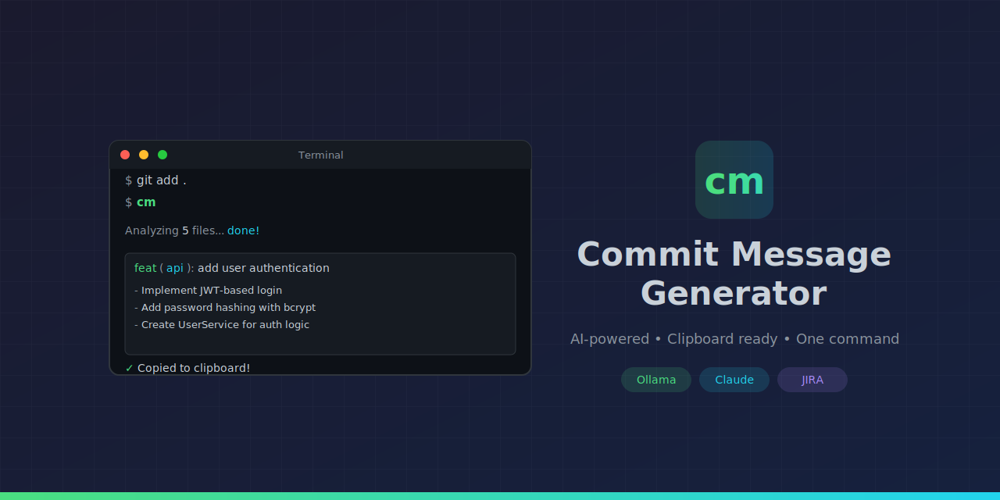

# Commit Message Generator (cm)



AI-powered commit message generator. Analyzes your staged changes, generates a descriptive message, copies it to your clipboard.

## Installation

**Option 1: Direct install from GitHub (recommended)**
```bash
pip install git+https://github.com/joemakescool/commit-msg-gen.git
```

**Option 2: Clone first, then install**
```bash
git clone https://github.com/joemakescool/commit-msg-gen.git
cd commit-msg-gen
pip install .
```

> **Windows users:** If `pip` isn't recognized, use `python -m pip` instead.

> **PATH issue?** If `cm` isn't recognized after install, you need to add Python Scripts to your PATH:
>
> **Step 1:** Find your Python Scripts path:
> ```powershell
> python -c "import sysconfig; print(sysconfig.get_path('scripts'))"
> ```
> This will output something like: `C:\Users\YourName\AppData\Local\Python\Python312\Scripts`
>
> **Step 2:** Add to PATH (pick one method):
>
> *Method A - Permanent (GUI):*
> 1. Press `Win + R`, type `sysdm.cpl`, press Enter
> 2. Click "Advanced" tab → "Environment Variables"
> 3. Under "User variables", select `Path` → "Edit"
> 4. Click "New" → paste the Scripts path from Step 1
> 5. Click "OK" on all dialogs
> 6. Restart your terminal
>
> *Method B - Permanent (PowerShell):*
> ```powershell
> # Get the scripts path
> $scriptsPath = python -c "import sysconfig; print(sysconfig.get_path('scripts'))"
>
> # Add to your PowerShell profile (creates file if needed)
> if (!(Test-Path $PROFILE)) { New-Item $PROFILE -Force }
> Add-Content $PROFILE "`n`$env:PATH += `";$scriptsPath`""
>
> # Reload profile
> . $PROFILE
> ```
>
> **Step 3:** Verify it works:
> ```powershell
> cm --version
> ```

That's it. The `cm` command is now available globally.

## Quick Start

```bash
# 1. Configure your AI provider (one time)
cm --setup

# 2. Use it
git add .                   # stage the files you want to commit
cm                          # generates message → copies to clipboard
git commit -m "<paste>"     # paste and commit
```

## How It Works

```
┌─────────────────────────────────────────────────────────────┐
│  You stage files: git add .                                 │
└─────────────────────────────────────────────────────────────┘
                            │
                            ▼
┌─────────────────────────────────────────────────────────────┐
│  You run: cm                                                │
│                                                             │
│  1. Reads your STAGED changes only                          │
│  2. Filters out noise (lock files, node_modules, etc.)      │
│  3. Sends to AI (Ollama or Claude)                          │
│  4. Copies generated message to clipboard                   │
└─────────────────────────────────────────────────────────────┘
                            │
                            ▼
┌─────────────────────────────────────────────────────────────┐
│  You commit: git commit -m "Ctrl+V"                         │
└─────────────────────────────────────────────────────────────┘
```

## Example Output

```
Analyzing 5 files... using Ollama (gemma3:4b)... done!

┌────────────────────────────────────────────────────────────────────┐
│ feat(api): add user authentication endpoint                        │
│                                                                    │
│ - Implement JWT-based login in AuthController                      │
│ - Added password hashing with bcrypt for security                  │
│                                                                    │
│ Refs: SITLA-1234                                                   │
└────────────────────────────────────────────────────────────────────┘

✓ Copied to clipboard!
```

## Commands

| Command | What it does |
|---------|--------------|
| `cm` | Generate message → copies to clipboard |
| `cm -c` | Choose from 2 options |
| `cm -j PROJ-123` | Add JIRA ticket to message |
| `cm --hint "fixing login"` | Add context for better messages |
| `cm -t fix` | Force a commit type |
| `cm -s simple` | Use simple style (no type prefix) |
| `cm --no-body` | Generate subject line only |
| `cm --setup` | Configure AI provider and preferences |
| `cm --display-config` | Show current configuration |
| `cm --warmup` | Pre-load Ollama model into memory |
| `cm --install-completion` | Install shell tab completion |
| `cm --no-copy` | Print only, don't copy |
| `cm --verbose` | Show debug info (tokens, prompt size) |
| `cm -v` | Show version |

## Configuration

Run `cm --setup` to configure defaults, or create a `.cmrc` file manually.

**Config file locations (checked in order):**
1. `.cmrc` in current directory (project-specific)
2. `.cmrc` in home directory (global default)

**Example `.cmrc`:**
```json
{
  "provider": "ollama",
  "model": "gemma3:4b",
  "style": "conventional",
  "include_body": true,
  "max_subject_length": 50
}
```

| Setting | Options | Description |
|---------|---------|-------------|
| `provider` | `auto`, `ollama`, `claude` | AI provider to use |
| `model` | any model name | Model override (e.g., `llama3.2:3b`) |
| `style` | `conventional`, `simple`, `detailed` | Commit message format |
| `include_body` | `true`, `false` | Include bullet points in body |
| `max_subject_length` | number | Max chars for subject line (default: 50) |

### Styles

| Style | Format | Example |
|-------|--------|---------|
| `conventional` | `type(scope): subject` + bullets | `feat(api): add rate limiting` |
| `simple` | Plain subject + bullets | `Add rate limiting to API` |
| `detailed` | `type(scope): subject` + more bullets | Longer descriptions, more context |

## Environment Variables

| Variable | Description |
|----------|-------------|
| `CM_PROVIDER` | Override provider: `ollama` or `claude` |
| `CM_MODEL` | Override model name |
| `ANTHROPIC_API_KEY` | Claude API key |
| `OLLAMA_HOST` | Ollama server URL (default: `http://localhost:11434`) |

## Troubleshooting

| Problem | Solution |
|---------|----------|
| `cm` not recognized | Re-run `pip install .` or restart terminal |
| "Ollama not running" | Run `ollama serve` in another terminal |
| "Model not found" | Run `ollama pull <model-name>` |
| "No staged changes" | Run `git add .` first |
| Clipboard not working | Use `cm --no-copy` and copy manually |
| Slow response | Try a smaller model: `cm -m llama3.2:3b` |
| Bad message quality | Try a bigger model: `cm -m mistral:7b` |

## Commit Types

| Type | When to use |
|------|-------------|
| `feat` | New feature |
| `fix` | Bug fix |
| `refactor` | Code restructuring |
| `chore` | Maintenance, deps |
| `docs` | Documentation |
| `test` | Tests |
| `style` | Formatting |
| `perf` | Performance improvement |
| `ci` | CI/CD changes |
| `build` | Build system changes |

Use `!` for breaking changes: `feat!(api): remove deprecated endpoint`

## AI Providers

### Ollama (Free, Local)

```powershell
# Install from https://ollama.ai
ollama pull gemma3:4b    # or llama3.2:3b, mistral:7b
ollama serve
```

### Claude API (Paid)

```powershell
$env:ANTHROPIC_API_KEY = "your-key"
```

## Message Format

**Conventional (default):**
```
type(scope): short subject line

- What changed (the main thing)
- Why it was needed (the problem)
```

**Simple:**
```
Short subject line

- What changed (the main thing)
- Why it was needed (the problem)
```

**Subject only (`--no-body`):**
```
type(scope): short subject line
```

## Project Structure

```
commit-msg-gen/
├── src/
│   ├── __init__.py          # Package root, version, commit types
│   ├── cli/                 # Command-line interface
│   │   ├── args.py          # Argument parsing
│   │   ├── commands.py      # Setup, config display, warmup
│   │   ├── main.py          # Entry point
│   │   └── utils.py         # Clipboard, message cleaning
│   ├── config/              # Configuration management
│   ├── git/                 # Git operations
│   │   ├── analyzer.py      # Staged changes extraction
│   │   └── diff_processor.py # Diff → LLM context
│   ├── llm/                 # LLM clients
│   │   ├── base.py          # Base classes, system prompt
│   │   ├── claude.py        # Anthropic API
│   │   └── ollama.py        # Local Ollama
│   ├── output/              # Terminal formatting
│   └── prompts/             # Prompt construction
│       └── builder.py       # PromptBuilder
├── pyproject.toml
└── README.md
```

## License

MIT
