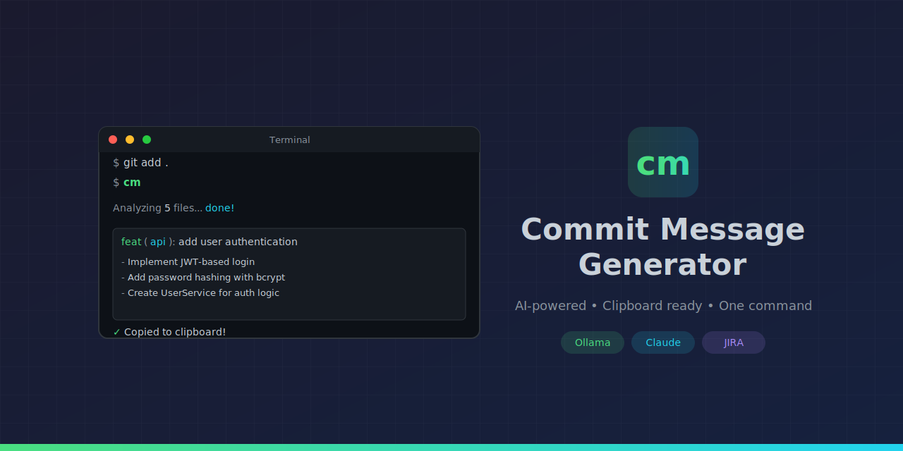

# cm



[](https://www.python.org/downloads/)
[](https://opensource.org/licenses/MIT)
[](https://github.com/joemakescool/commit-msg-gen)

**AI-powered git commit messages.** Stage your changes, run `cm`, paste the result.

```
$ git add .
$ cm
Staged changes:
  src/auth/tokens.py (+42 -8)
  src/auth/cookies.py (+15 -3)
  src/auth/tracking.py (+28 -0)
Analyzing 3 files using Claude... done!

───────────────────────────────────────────────────────
feat(auth): add JWT refresh token rotation

- implement automatic token refresh before expiry
- add refresh token storage in httpOnly cookies
- include token family tracking for reuse detection
───────────────────────────────────────────────────────
✓ Copied to clipboard!

(e)dit, (r)egenerate, or Enter to accept:

$ git commit -m "<paste>"
```

## Why cm?

`cm` does one thing: generate a commit message. It doesn't hook into git, manage workflows, or automate your commits. You stage changes, run `cm`, and paste the result. That's the whole design — stay out of the way and let you stay in control.

- **Understands context** — Analyzes your actual diff, not just file names
- **Conventional commits** — Proper `type(scope): subject` format out of the box
- **Works offline** — Use Ollama for free, local generation
- **Zero friction** — Copies to clipboard automatically
- **Pipe-friendly** — Use in scripts: `cm | pbcopy`, `message=$(cm)`
- **Refine interactively** — Edit, regenerate with hints, or accept in one step

## Quick Start

```bash
# Install from a local clone (most reliable on Windows)
git clone https://github.com/joemakescool/commit-msg-gen.git
cd commit-msg-gen
python -m pip install -e .

# Use
git add .
cm
git commit   # paste the message
```

That's it. Works immediately with [Ollama](https://ollama.ai) if you have it running, or configure Claude API with `cm --setup`.

## Installation

### From a local clone (recommended for Windows / developing)

```bash
git clone https://github.com/joemakescool/commit-msg-gen.git
cd commit-msg-gen
python -m pip install -e .
```

The `-e` flag makes it editable — code changes are picked up without reinstalling.

### Direct from GitHub

```bash
# With pipx (isolates CLI tools — install pipx first if needed)
pipx install git+https://github.com/joemakescool/commit-msg-gen.git

# Or via Python's pip module (works even if `pip` isn't on PATH)
python -m pip install git+https://github.com/joemakescool/commit-msg-gen.git
```

> **Why `python -m pip` instead of `pip`?** On Windows (especially PowerShell), bare `pip` and `pipx` often aren't on the PATH, but `python` is. `python -m pip` always uses the pip that ships with the active Python interpreter.

<details>
<summary><strong>Windows PATH issues?</strong></summary>

If `cm` isn't recognized after install, add Python Scripts to your PATH:

**Step 1:** Find where pip installed `cm`:
```powershell
python -c "import site; print(site.getusersitepackages().replace('site-packages','Scripts'))"
```

**Step 2:** Add to PATH (pick one):

*GUI method:*
1. Press `Win + R`, type `sysdm.cpl`, press Enter
2. Advanced → Environment Variables
3. Edit `Path` under User variables → Add the scripts path from Step 1
4. Restart terminal

*PowerShell method:*
```powershell
$scriptsPath = python -c "import site; print(site.getusersitepackages().replace('site-packages','Scripts'))"
if (!(Test-Path $PROFILE)) { New-Item $PROFILE -Force }
Add-Content $PROFILE "`n`$env:PATH += `";$scriptsPath`""
. $PROFILE
```

**Step 3:** Verify: `cm --version`

</details>

## Usage

### Basic

```bash
cm                          # Generate and copy to clipboard
cm --no-copy                # Print only
cm --verbose                # Show token usage and timing
```

### After Generation

After displaying the message, `cm` prompts you to refine it:

- **Enter** — Accept the message (already on clipboard)
- **`e`** — Open in your `$EDITOR` to tweak wording, then re-copies
- **`r`** — Regenerate with an optional hint to steer the AI

```
(e)dit, (r)egenerate, or Enter to accept: r
  Hint (Enter to skip): focus on the database migration
Regenerating... done!
```

### Guide the AI

```bash
cm --hint "fixing the auth bug"   # Add context
cm -t fix                          # Force commit type
cm -j PROJ-123                     # Append JIRA ticket
cm -c                              # Generate 2 options, pick one
cm -c 3                            # Generate 3 options, pick one
cm -j PROJ-123 --ticket-prefix Closes  # Use custom prefix
```

### Style Options

```bash
cm -s conventional          # feat(scope): subject + bullets (default)
cm -s simple                # Plain subject + bullets
cm -s detailed              # More comprehensive bullets
cm --no-body                # Subject line only
```

### Provider Selection

```bash
cm -p ollama                # Use local Ollama
cm -p claude                # Use Claude API
cm -m mistral:7b            # Specify model
```

### Scripting & Pipes

When piped, `cm` outputs only the raw commit message to stdout — no colors, no prompts, no clipboard. Status messages go to stderr.

```bash
cm | pbcopy                     # macOS: pipe to clipboard
cm | xclip -selection clipboard # Linux: pipe to clipboard
cm | head -1                    # Get just the subject line
message=$(cm)                   # Capture in a variable
```

### All Commands

| Command | Description |
|---------|-------------|
| `cm` | Generate message, copy to clipboard |
| `cm -c` / `cm -c N` | Choose from N options (default: 2, max: 4) |
| `cm --hint TEXT` | Add context for better messages |
| `cm -t TYPE` | Force commit type (feat, fix, etc.) |
| `cm -j TICKET` | Append JIRA reference |
| `cm --ticket-prefix PREFIX` | Ticket prefix: Refs, Closes, Fixes |
| `cm -s STYLE` | Set style: conventional, simple, detailed |
| `cm --no-body` | Subject line only |
| `cm -p PROVIDER` | Use: auto, ollama, claude |
| `cm -m MODEL` | Specify model name |
| `cm --warmup` | Pre-load Ollama model |
| `cm --no-copy` | Don't copy to clipboard |
| `cm --verbose` | Show debug info |
| `cm --setup` | Configure defaults |
| `cm --display-config` | Show current config |
| `cm --install-completion` | Shell tab completion |
| `cm -v` | Show version |

## Configuration

Run `cm --setup` to configure defaults, or create a `.cmrc` file manually.

**Config file locations (checked in order):**
1. `.cmrc` in current directory (project-specific)
2. `.cmrc` in home directory (global default)

**Example `.cmrc`:**
```json
{
  "provider": "ollama",
  "model": "gemma3:4b",
  "style": "conventional",
  "include_body": true,
  "max_subject_length": 72,
  "ticket_prefix": "Refs"
}
```

| Setting | Options | Description |
|---------|---------|-------------|
| `provider` | `auto`, `ollama`, `claude` | AI provider to use |
| `model` | any model name | Model override (e.g., `llama3.2:3b`) |
| `style` | `conventional`, `simple`, `detailed` | Commit message format |
| `include_body` | `true`, `false` | Include bullet points in body |
| `max_subject_length` | number | Max chars for subject line (default: 72) |
| `ticket_prefix` | any string | Ticket reference prefix (default: `Refs`) |

### Styles

| Style | Format | Example |
|-------|--------|---------|
| `conventional` | `type(scope): subject` + bullets | `feat(api): add rate limiting` |
| `simple` | Plain subject + bullets | `Add rate limiting to API` |
| `detailed` | `type(scope): subject` + more bullets | Longer descriptions, more context |

## Environment Variables

| Variable | Description |
|----------|-------------|
| `CM_PROVIDER` | Override provider: `ollama` or `claude` |
| `CM_MODEL` | Override model name |
| `CM_TIMEOUT` | Request timeout in seconds (default: 300). Increase for slow CPU inference. |
| `ANTHROPIC_API_KEY` | Claude API key |
| `OLLAMA_HOST` | Ollama server URL (default: `http://localhost:11434`) |

## Commit Types

| Type | When to use |
|------|-------------|
| `feat` | New feature |
| `fix` | Bug fix |
| `refactor` | Code restructuring |
| `chore` | Maintenance, deps |
| `docs` | Documentation |
| `test` | Tests |
| `style` | Formatting |
| `perf` | Performance improvement |
| `ci` | CI/CD changes |
| `build` | Build system changes |

Use `!` for breaking changes: `feat!(api): remove deprecated endpoint`

## AI Providers

### Ollama (Free, Local)

[Install Ollama](https://ollama.ai), then:

```bash
ollama pull mistral:7b    # Recommended - fast and reliable
ollama serve              # Start the server
```

**Recommended models (7B+ for best results):**
- `mistral:7b` - Fast, good quality (recommended)
- `llama3.1:8b` - Best overall
- `gemma2:9b` - Most detailed, slower

**Note:** 3B models often hallucinate and ignore the diff. Use 7B+ for reliable results.

**Pro tip:** Pre-load the model for faster first response:
```bash
cm --warmup
```

### Claude API

Get an API key from [Anthropic](https://console.anthropic.com), then:

```bash
export ANTHROPIC_API_KEY="sk-ant-..."   # Linux/macOS
$env:ANTHROPIC_API_KEY = "sk-ant-..."   # PowerShell
```

<details>
<summary><strong>Troubleshooting</strong></summary>

| Problem | Solution |
|---------|----------|
| `cm` not recognized | Re-run `python -m pip install -e .` or restart terminal |
| `pip` / `pipx` not recognized (Windows) | Use `python -m pip install -e .` instead |
| "Ollama not running" | Run `ollama serve` in another terminal |
| "Model not found" | Run `ollama pull <model-name>` |
| "No staged changes" | Run `git add .` first |
| Clipboard not working | Use `cm --no-copy` and copy manually |
| Hallucinated messages | Use 7B+ model: `cm -m mistral:7b` (3B models often ignore the diff) |
| Slow response | Try `mistral:7b` (faster than larger models) |
| Timeout on CPU | Increase timeout: `set CM_TIMEOUT=600` or pre-load: `cm --warmup` |

</details>

<details>
<summary><strong>Project Structure</strong></summary>

```
src/
├── cli/                 # Command-line interface
│   ├── args.py          # Argument parsing
│   ├── commands.py      # Setup, config, warmup
│   ├── main.py          # Entry point
│   └── utils.py         # Clipboard, formatting
├── config/              # Configuration management
├── git/                 # Git operations
│   ├── analyzer.py      # Extract staged changes
│   └── diff_processor.py # Filter and prioritize diffs
├── llm/                 # LLM providers
│   ├── base.py          # Abstract client, system prompt
│   ├── claude.py        # Anthropic API
│   └── ollama.py        # Local Ollama
├── output/              # Terminal colors and formatting
└── prompts/             # Prompt construction
    └── builder.py       # Build context for LLM
```

Each package owns one concern and exposes its API through `__init__.py`. The flow is a straight pipeline: **git** extracts the diff, **prompts** builds the LLM input, **llm** generates the message, **output** formats it, and **cli** orchestrates everything. No package imports from `cli` — dependencies only flow inward.

The LLM layer uses the **Strategy pattern** — `LLMClient` is an abstract base class that defines the interface (`generate()`, `name`), and each provider (`ClaudeClient`, `OllamaClient`) implements it independently. A `PROVIDERS` registry and `get_client()` factory handle instantiation, so the rest of the codebase never knows which provider it's talking to. Adding a new provider means writing one class and adding one line to the registry.

This follows **SOLID principles** throughout:
- **Single Responsibility** — each package handles exactly one concern (git ops, prompt building, LLM communication, terminal output)
- **Open/Closed** — new providers extend `LLMClient` without modifying existing code
- **Liskov Substitution** — any `LLMClient` subclass works wherever the base class is expected
- **Interface Segregation** — `LLMClient` exposes only `generate()` and `name`, nothing provider-specific leaks
- **Dependency Inversion** — `cli/main.py` depends on the `LLMClient` abstraction, never on concrete providers

The only external dependency is `anthropic` for the Claude client — git runs via `subprocess`, Ollama via `urllib`, and colors via raw ANSI codes. Configuration cascades from CLI args to environment variables to config file to defaults.

</details>

## License

MIT
